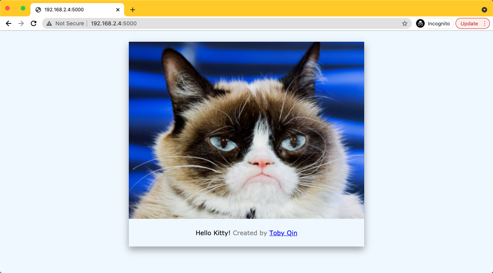

# A Hello Docker App

Python demo app to run with Docker. This app displays a random picture of a cat.



## Build and run locally

You should have python 3.x installed locally.

```bash
pip install -r requirements.txt
python app.py
```

Open [http://localhost:5000/](http://localhost:5000/) in your web browser to view the running app.

## Build and run with Docker

```bash
# build Dockerfile, please change username in the command
docker build -t tobyqin/hello:latest .

# run it
docker run -it --rm -p 5000:5000 tobyqin/hello

# publish to docker hub
docker login
docker push tobyqin/hello
```

## Just use it

This cat app has already been published to docker hub, you can run it by:

```bash
docker run -d -p 5000:5000 --restart=always tobyqin/hello
```
